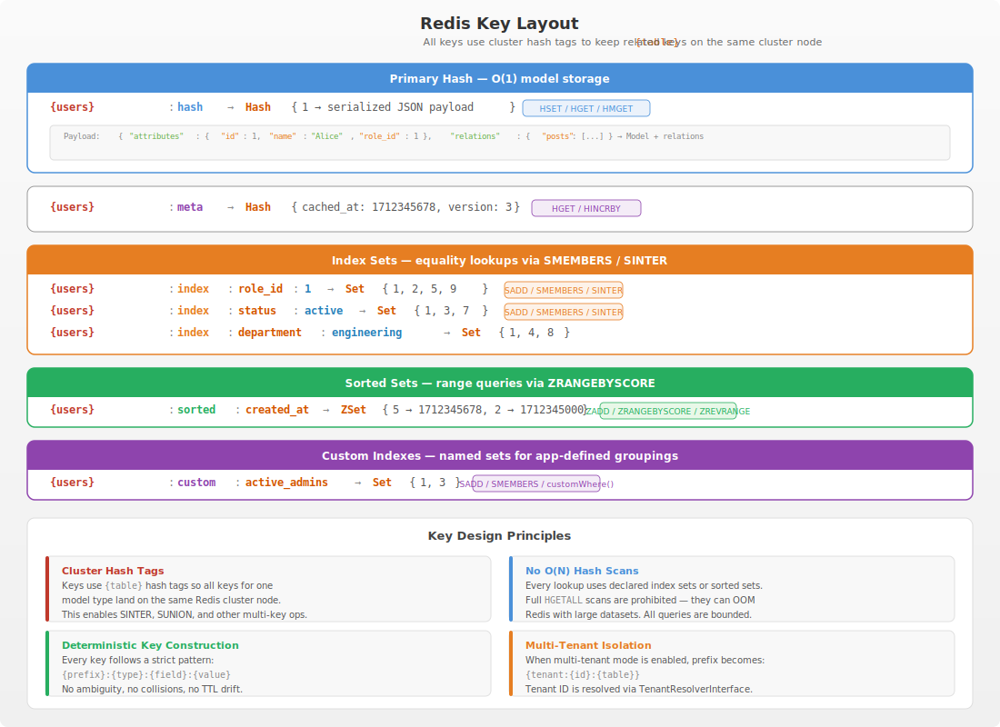
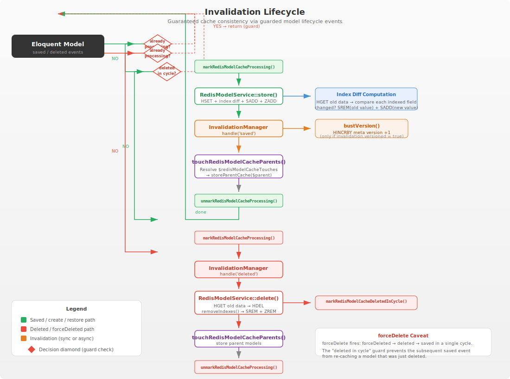

# Architecture

## Data Flow







```
┌──────────────┐    saved/deleted     ┌───────────────────┐
│  Eloquent    │─────────────────────▶│  HasRedisModelCache│
│  Model       │                      │  (trait)           │
│              │◀─────────────────────│                   │
└──────────────┘    touch parents     └────────┬──────────┘
                                               │
                                    resolveRedisModelCacheService()
                                               │
                                               ▼
                                      ┌───────────────────┐
                                      │  RedisModelService │
                                      │                   │
                                      │  ┌─────────────┐  │
                                      │  │ Key Builder  │  │
                                      │  │ {prefix}:*   │  │
                                      │  └─────────────┘  │
                                      │  ┌─────────────┐  │
                                      │  │ IndexResolver│  │
                                      │  │ where→SINTER │  │
                                      │  └─────────────┘  │
                                      │  ┌─────────────┐  │
                                      │  │ QueryPlanner│  │
                                      │  │ explain mode│  │
                                      │  └─────────────┘  │
                                      └────────┬──────────┘
                                               │
                                               ▼
                                      ┌───────────────────┐
                                      │  Redis (hash+sets) │
                                      └───────────────────┘
```

## Key Space

Every model type gets its own key prefix. All keys use Redis cluster hash tags `{...}` so keys for the same model land on the same cluster node.

### Standard model (no tenant)

```
{users}:hash                           → Hash: {id → serialized model}
{users}:meta                           → Hash: {cached_at, version}
{users}:index:role_id:1               → Set: {model IDs}
{users}:index:status:active           → Set: {model IDs}
{users}:sorted:created_at             → ZSet: {model ID → score}
{users}:custom:active_admins          → Set: {model IDs}
{users}:custom:active_admins:sorted:created_at  → ZSet: {model ID → score}
```

### Multi-tenant model

```
{tenant:42:users}:hash
{tenant:42:users}:meta
{tenant:42:users}:index:role_id:1
...
```

### Lock keys (stampede protection)

```
{users}:lock:stampede                 → String: '1' or UUID value (stampede lock)
{users}:lock:swr                      → String: '1' or UUID value (SWR lock)
```

All lock keys use a dedicated lock namespace under the same hash tag,
ensuring cross-slot safety for Lua-based compare-and-swap release.

## Key Construction

All keys are built through the centralized `RedisKeyBuilder` class at `src/Support/RedisKeyBuilder.php`:

| Method | Key Pattern |
|---|---|
| `buildModelHashKey()` / `hashKey()` | `{prefix}:hash` |
| `buildMetaKey()` / `metaKey()` | `{prefix}:meta` |
| `buildLockKey()` / `lockKey()` | `{prefix}:lock:{suffix}` (default: `stampede`) |
| `buildSWRLockKey()` / `swrLockKey()` | `{prefix}:lock:swr` |
| `buildIndexKey($field, $value)` / `indexKey()` | `{prefix}:index:{$field}:{$value}` |
| `buildSortedIndexKey($field)` / `sortedKey()` | `{prefix}:sorted:{$field}` |
| `customIndexKey($name)` | `{prefix}:custom:{$name}` |
| `sortedCustomKey($name, $field)` | `{prefix}:custom:{$name}:sorted:{$field}` |

Where `{prefix}` is `{table}` for single-tenant or `{tenant:{id}:{table}}` for multi-tenant.
All keys share the same Redis cluster hash tag, guaranteeing cross-slot safety for
Lua scripts and multi-key operations.

The `RedisKeyBuilder` is instantiated per model service via `RedisKeyBuilder::for($table, $tenantId)`,
and all legacy method names (`hashKey()`, `metaKey()`, etc.) are preserved as backward-compatible
aliases that delegate to the new `build*()` methods.

## Index Query Resolution

The `IndexResolver` maps where clauses to Redis commands deterministically:

| # of where fields | Redis command | Complexity |
|---|---|---|
| 1 | `SMEMBERS key` | O(N) where N = set cardinality |
| 2+ | `SINTER key1 key2 ...` | O(N1 + N2 + ... + intersection) |
| whereIn, 1 value | `SMEMBERS key` | O(N) |
| whereIn, 2+ values | `SUNION key1 key2 ...` | O(N1 + N2 + ...) |

### Field validation

Every where field must be declared in the `$indexes` constructor argument. If a field is not indexed, `where()`, `whereIn()`, `orWhere()`, `selective()`, `pluck()`, `first()`, `count()`, and `exists()` throw `InvalidArgumentException`.

This is intentional — it prevents accidental O(N) hash scans.

## Serialization Format

```php
[
    'attributes' => ['id' => 1, 'name' => 'Alice', 'role_id' => 1, ...],
    'relations' => [
        'posts' => [
            [
                'class' => 'App\Models\Post',
                'attributes' => ['id' => 10, 'title' => '...', ...],
                'relations' => ['comments' => [...], ...],
            ],
        ],
        'profile' => [
            'class' => 'App\Models\Profile',
            'attributes' => [...],
            'relations' => [],
        ],
    ],
]
```

Relations are serialized recursively. On hydration, `newFromBuilder()` sets attributes, then `restoreRelations()` reconstructs the relation tree.

## Storage Flow

### Single model store (`store()` / `storeModel()`)

```
1. Read old hash data via HGET (for stale index and sorted set detection)
2. If Lua enabled:
   → Execute EVAL with KEYS=[hash, stale-rem, new-sadd, stale-zrem, new-zadd] ARGV=[id, payload, ttl, ...]
   → Atomic: HSET + SREM(stale) + SADD(new) + ZREM(stale) + ZADD(new) + EXPIRE(all)
3. If Lua disabled or pipeline batch:
   → Pipeline: HSET + SREM(stale) + SADD(new) + ZREM(stale) + ZADD(new) + EXPIRE(all)
   → executePipeline()
4. Update cache metadata (cached_at timestamp)
```

### Batch store (`storeMany()`)

```
1. HMGET all old data in one call (instead of N individual HGETs)
2. Compute stale index and sorted set keys for each model from old data
3. If Lua enabled: primeAtomicStoreScript() → SCRIPT LOAD
4. Pipeline: EVALSHA × N (one per model) or HSET + SREM + SADD + ZREM + ZADD × N
5. executePipeline()
6. Apply TTL to hash
7. Store cache metadata
```

When Lua scripting is enabled, each model in the batch is stored via a single EVALSHA
command in the pipeline. The script is loaded into the Redis cache before the pipeline
begins (`primeAtomicStoreScript()`), eliminating NOSCRIPT fallback within the batch.
The pipeline guarantees atomic execution of all EVALSHA commands from the caller's
perspective — no partial writes. When Lua is disabled, individual Redis commands
(HSET, SREM, SADD, ZREM, ZADD, EXPIRE) are queued in the pipeline as before.

If pipeline execution or any post-pipeline step fails, the partial writes are automatically cleaned up by calling `clear()` to prevent inconsistent state, and the original exception is rethrown.

## Stampede Protection Flow

```
1. Check hash exists via EXISTS
2. If hash missing AND stampede enabled:
   → Try SET lockKey value NX EX timeout
   → If acquired: execute callback, store data, release lock (DEL or Lua CAS)
   → If not acquired:
     → Initial jitter sleep (random_int) ← NEW v2.2
     → Poll EXISTS(lockKey) with exponential backoff + jitter ← NEW v2.2
     → If lock released before deadline: try EXISTS(hashKey)
       → If hash exists: serve from cache
       → If not: fall through to callback
     → If deadline exceeded: return false (fail-fast) ← NEW v2.2
```

### v2.2 Backoff Strategy

| Attempt | Sleep | Jitter Added |
|---------|-------|-------------|
| 0 (initial) | `random_int(0, min(base, 1000)) * 100` µs | De-synchronises first poll |
| 1 | `min(1000, base × 2¹)` ms | `random_int(0, sleepMs/2)` ms |
| 2 | `min(1000, base × 2²)` ms | `random_int(0, sleepMs/2)` ms |
| 3 | `min(1000, base × 2³)` ms | `random_int(0, sleepMs/2)` ms |
| 4+ | `min(1000, base × 2⁴)` = 1000ms (capped) | `random_int(0, 500)` ms |

The CAS release uses a Lua script to atomically compare-and-delete the lock, preventing accidental release of another process's lock.

## Invalidation Flow

See [invalidation.md](invalidation.md) for full documentation.

## Configuration Dependencies

```
observability.enabled → enables event dispatching
observability.dispatch_events → individual event dispatch toggle
stampede_protection.enabled → enables lock mechanism in rememberAll()
stale_while_revalidate.enabled → enables SWR path in rememberAll()
lua_scripting.enabled → enables atomic Lua stores
compression.enabled → enables compress/decompress on serialization
multi_tenant.enabled → enables tenant prefix in buildPrefix()
```

## Redis Command Inventory

Every Redis command used by this package:

| Command | Purpose | Called By |
|---|---|---|
| `EXISTS` | Check key existence | `rememberAll`, `rememberIndex`, `rememberCustom`, `exists()`, `applyTTL`, Stampede wait |
| `HGET` | Read single payload | `find()`, `first()`, `computeStaleIndexKeys()`, `inspect()`, `updateAttributes()` |
| `HMGET` | Read batch payloads | `hydrateIds()`, `pluck()`, `selective()`, `storeMany()` |
| `HSET` | Store payload | `storeModel()`, `updateAttributes()` |
| `HDEL` | Remove payload | `delete()` |
| `HLEN` | Count hash fields | `analyzeIndexes()` |
| `HINCRBY` | Increment version | `bustVersion()` |
| `SADD` | Add to index set | `storeIndexes()`, `rememberIndex()`, `rememberCustom()` |
| `SREM` | Remove from index set | `delete()`, `removeIndexes()`, `storeModel()`, `updateAttributes()` |
| `SMEMBERS` | Get all set members | `where()` (single index), `findByIndex()`, `inspect()`, `custom()` |
| `SCARD` | Set cardinality | `count()` (single index), `analyzeIndexes()` |
| `SINTER` | Set intersection | `where()` (multi-index), `customWhere()`, `count/exists()`, `orWhere()` |
| `SUNION` | Set union | `whereIn()` (multi-value) |
| `ZADD` | Add to sorted set | `storeSorted()`, `rememberCustom()` |
| `ZREM` | Remove from sorted set | `removeSorted()`, `delete()` |
| `ZREVRANGE` | Get sorted by score desc | `sorted()`, `paginateSorted()` |
| `ZRANGEBYSCORE` | Get sorted by score range | `whereBetween()` |
| `ZRANGE` | Get sorted by index | `rememberCustom()` |
| `ZCARD` | Sorted set cardinality | `analyzeIndexes()` |
| `ZSCORE` | Get score for member | `inspect()` |
| `SCAN` | Pattern-match keys | `clear()`, `clearAll()`, `analyzeIndexes()` |
| `DEL` | Delete keys | `clear()`, `clearAll()`, `delete()` (lock), lock release |
| `EXPIRE` | Set key TTL | Throughout (propagated to all key types) |
| `TTL` | Check key TTL | `applyTTL()`, `inspect()`, `analyzeIndexes()` |
| `SET NX EX` | Acquire lock | `StampedeProtection::acquireLock()` |
| `EVAL` / `EVALSHA` | Lua scripting | `storeModelAtomic()`, `StampedeProtection::releaseLockCas()` |

## Design Decisions

### Why block `all()`?

Full hash scans via HGETALL or HSCAN can OOM a Redis instance with large datasets. The package explicitly forbids unindexed queries. Every lookup must use declared indexes, which use Redis sets with O(1) or O(N) bounded operations.

### Why no `KEYS` command?

`KEYS` blocks Redis for the duration of the scan. The package uses `SCAN` (cursor-based) for all pattern-matching operations, which is production-safe.

### Why hash tags `{table}`?

Redis cluster distributes keys across nodes based on hash slots. Without hash tags, related keys (hash + indexes + sorted sets for a model) could land on different nodes, making SINTER and other multi-key operations impossible. The hash tag ensures all keys for a model share the same slot.

### Why `prefer-stable` over `prefer-lowest` in CI?

The package uses modern PHP 8.4 features (constructor property promotion, typed properties) and Laravel 12 APIs. Lowest-dependency testing would fail on PHP 8.3 or Laravel 11. The matrix covers both stability modes for compatibility breadth within the supported range.

## Octane & Long-Running Worker Isolation (v2.5)

### Memory Safety

| Component | v2.1 (unbounded) | v2.5 (bounded/scoped) | Risk if unbounded |
|-----------|-----------------|----------------------|-------------------|
| `Observability::$latencySamples` | `array[]` append | Ring buffer 1000, modulo index | OOM after ~8M requests |
| `Observability::$pipelineSizes` | `array[]` append | Ring buffer 1000, modulo index | OOM after ~8M requests |
| `Observability::latencyPercentile()` | Sort full array | `flattenRingBuffer()` then sort | O(N log N) on unbounded array |
| `RedisModelCacheState` (processing) | Static arrays in trait | Scoped service, auto-reset per request | Request-state bleed |
| `RedisModelCacheState` (deletedInCycle) | Static arrays in trait | Scoped service, auto-reset per request | Request-state bleed |

### Lifecycle Hook Registration

Registered in `RedisModelCacheServiceProvider::registerLifecycleHooks()`:

```php
// All environments — flush scoped state
App::terminating(function (): void {
    if ($this->app->resolved(RedisModelCacheState::class)) {
        $this->app->make(RedisModelCacheState::class)->flush();
    }
});

// Octane only (when package installed)
if (class_exists(WorkerTickStarting::class)) {
    $this->app->make('events')->listen(
        WorkerTickStarting::class,
        function (): void {
            if ($this->app->resolved(RedisModelCacheState::class)) {
                $this->app->make(RedisModelCacheState::class)->flush();
            }
            $this->app->make(Observability::class)->reset();
        }
    );
}
```

The `RedisModelCacheState` is registered as a **scoped** binding (`$this->app->scoped()`),
which means Laravel/Octane automatically creates a fresh instance per request or
per Octane worker tick. This replaces the previous approach of flushing static
arrays in the `HasRedisModelCache` trait, making the package fully safe for
Octane workers without relying on lifecycle hook timing.

### Ring Buffer Flattening

`flattenRingBuffer()` returns samples in insertion order regardless of wrap state:

```
Before wrap (latIdx < MAX):       [0, 1, 2, ..., latIdx-1]
After wrap (latIdx >= MAX):       [latIdx%MAX, ..., MAX-1, 0, ..., latIdx%MAX-1]
```

Statistical methods (`latencyPercentile()`, `averageLatency()`, etc.) always operate
on the flattened, correctly-ordered sample set.

## Production Monitoring Safety (v2.2)

### SCAN-only Operations

All pattern-matching Redis operations use cursor-based `SCAN` with configurable batch size:

| Location | Before v2.2 | v2.2 |
|----------|-------------|------|
| `MonitorCacheCommand::showKeys()` | `$redis->keys($pattern)` | `$this->scanKeys($redis, $pattern)` |
| `MonitorCacheCommand::checkTTL()` | `$redis->keys($pattern)` | `$this->scanKeys($redis, $pattern)` |
| `MonitorCacheCommand::showMemory()` | `$redis->keys($pattern)` | `$this->scanKeys($redis, $pattern)` |
| `MonitorCacheCommand::clearCache()` | `$redis->keys($pattern)` | `$this->scanKeys($redis, $pattern)` |
| `RedisModelService::collectKeysByPattern()` | — | `SCAN` with configurable count |

### Config Validation

The `scan_strategy` config key is validated at service provider boot:

```php
$scanStrategy = config('redis-model-cache.scan_strategy');
if ($scanStrategy !== 'scan') {
    throw new \InvalidArgumentException(
        "Invalid scan_strategy: only 'scan' is supported."
    );
}
```

This provides a compile-time guarantee that no `KEYS` command is ever issued by the
package, even if someone forked or monkey-patched the code.

## Public API Surface (Frozen at v2.2.0)

### Contracts (stable, breaking changes require major version bump)

- `Sm_mE\RedisModelCache\Contracts\ModelCacheService`
- `Sm_mE\RedisModelCache\Contracts\HashCacheService`
- `Sm_mE\RedisModelCache\Contracts\RedisConnectionResolver`
- `Sm_mE\RedisModelCache\Contracts\ModelMatchStrategy`
- `Sm_mE\RedisModelCache\Contracts\TenantResolverInterface`
- `Sm_mE\RedisModelCache\Invalidation\Contracts\InvalidationStrategy`

### Service (stable)

- `Sm_mE\RedisModelCache\RedisModelService` — all public methods

### Trait (stable)

- `Sm_mE\RedisModelCache\Concerns\HasRedisModelCache`

### Support classes (stable, but may extend with new methods)

- `Sm_mE\RedisModelCache\Support\StampedeProtection`
- `Sm_mE\RedisModelCache\Support\IndexResolver`
- `Sm_mE\RedisModelCache\Support\ExplainResult`
- `Sm_mE\RedisModelCache\Support\CacheManager`
- `Sm_mE\RedisModelCache\Support\QueryPlanner`
- `Sm_mE\RedisModelCache\Support\DefaultConnectionResolver`
- `Sm_mE\RedisModelCache\Support\TenantResolvers\RequestTenantResolver`

### Events (stable)

- `Sm_mE\RedisModelCache\Events\CacheHit`
- `Sm_mE\RedisModelCache\Events\CacheMiss`
- `Sm_mE\RedisModelCache\Events\QueryExecuted`
- `Sm_mE\RedisModelCache\Events\ModelCacheInvalidated`

### Console commands (stable)

- `redis-model-cache:warmup` — pre-populate cache from database
- `redis-model-cache:debug` — inspect service state, metrics, config (legacy alias: `redis-cache:debug`)
- `redis-model-cache:monitor-cache` — monitor keys, TTL, memory, and manage cache (legacy alias: `redis:monitor-cache`)

### Jobs (stable)

- `Sm_mE\RedisModelCache\Jobs\RevalidateCacheJob`
- `Sm_mE\RedisModelCache\Jobs\InvalidateModelCacheJob`

### Invalidation (stable)

- `Sm_mE\RedisModelCache\Invalidation\InvalidationManager`
- `Sm_mE\RedisModelCache\Invalidation\InvalidationContext`
- `Sm_mE\RedisModelCache\Invalidation\Strategies\SyncStrategy`
- `Sm_mE\RedisModelCache\Invalidation\Strategies\AsyncStrategy`
